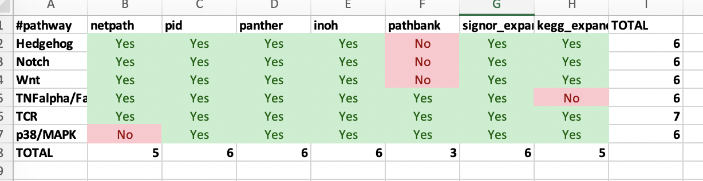
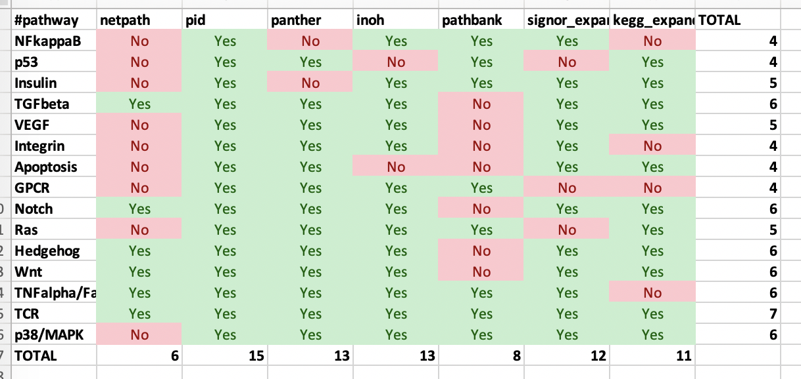

# Pathway Database Parsers & Associated Code

This directory contains code to generate network files for signaling pathway databases. It also contains code to find corresponding pathways across databases.

All pathways must pass these minimal filters:
- All nodes must be proteins (e.g., have a UniProtKB identifier) unless they are "collapsed".
- There must be at least 10 interactions

## PathwayCommons

The first pathway databases were parsed from  [PathwayCommons](https://www.pathwaycommons.org/). These and all other downloaded files are in `infiles/`.

### Panther

Download `PathwayCommons11.panther.hgnc.txt.gz` from [PC2v11](https://www.pathwaycommons.org/archives/PC2/v11/) and unzip it in `infiles/`.

```
python3 parse_pathwaycommons.py -i infiles/PathwayCommons11.panther.hgnc.txt -o ../../networks/dbs/
```

30 too small, 0 nonhuman, 0 identical. 92 TOTAL parsed.

### NCI-PID

Download `PathwayCommons11.pid.hgnc.txt.gz` from [PC2v11](https://www.pathwaycommons.org/archives/PC2/v11/) and unzip it in `infiles/`.  

```
python3 parse_pathwaycommons.py -i infiles/PathwayCommons11.pid.hgnc.txt -o ../../networks/dbs/
```

10 too small, 0 nonhuman, 0 identical. 202 TOTAL parsed.

### INOH

Download `PathwayCommons11.inoh.hgnc.txt.gz` from [PC2v11](https://www.pathwaycommons.org/archives/PC2/v11/) and unzip it in `infiles/`. In addition, pathways labeled as Mammal, C. elegans, Drosophila, etc., are duplicate pathways and should be ignored.  37 pathways are ignored.

```
python3 parse_pathwaycommons.py -i infiles/PathwayCommons11.inoh.hgnc.txt -o ../../networks/dbs/
```

57 too small, 26 nonhuman, 37 identical. 113 TOTAL parsed.


## NDex Pathways

These pathways are stored in [CX format](https://home.ndexbio.org/data-model/) from [NDEx](https://home.ndexbio.org/index/).  You have to individually download the `.cx` files for original networks (there is no bulk data download avaialable).

### SIGNOR

I manually downloaded all pathway `.cx` files from NDEx listed as "Signor Signaling, Disease, and Cancer Pathways". They are listed in `infiles/signor/`.

I also downloaded the protein family IDs from the [original SIGNOR database](https://signor.uniroma2.it/downloads.php#signor_entity), saved it as 'infiles/signor/SINOR_PF.csv'.  

Like KEGG, SIGNOR will have a "collapsed" and an "expanded" version. SIGNOR also makes use of the `mapping.txt`file (like KEGG and Reactome).  We also ignore relationships that are not among proteins (e.g., stimuli or phenotype relations).  Finally, there might be some spaces in the common names of complexes and protein families - remember that these are tab delimited and should be split as such.

```
python3 parse_signor.py
```

- **signor_collapsed**: 0 too small, 35 TOTAL parsed.
- **signor_expanded**: 0 too small, 35 TOTAL parsed.

## Original Pathway Databases

The final set of pathway databases are parsed from their original form. While they are available in some form from PathwayCommons, there are issues with each one (not all NetPath pathways area available, only KEGG metabolic pathways are available, and Reactome pathways are not parsed according to the hierarchy).

### NetPath

Original 32 pathways from [NetPath](http://www.netpath.org/), used in previous publications such as [PathLinker](https://www.nature.com/articles/npjsba20162), are stored in `infiles/netpath`.  The script below makes the pathways undirected and two-column files to drop in `../../networks/dbs/`.

```
python3 parse_netpath.py
```

1 too small. 31 TOTAL parsed.

### KEGG

KEGG files are parsed according to an older [KEGG Pathway Parser](https://github.com/Reed-CompBio/pathway-parsers) which downloads KGML files and generates two types of files: `collapsed` files which includes protein complexes and protein families as individual nodes and `expanded` files that expand these entities into the individual proteins. These KGML files were downloaded Jul 14 2020 and moved to `infiles/kegg`.

The script below renames the pathways according to the `_pathway_list.txt` file in the KEGG directory, makes the edges undirected and two-columns. Drops them in `../../networks/kegg/collapsed/` and `../../networks/kegg/expanded`.

```
python3 parse_kegg.py
```

This file uses `mapping.txt` (downloaded Name & Uniprot from [HGNC mapper](https://www.genenames.org/download/custom/)). Also note that since we require at least 10 edges, this means that collapsed and expanded are slightly different in terms of the number of pathways. THis shouldn't affect the corresponding pathway analysis though.

- **collapsed:** 95 too small. 242 TOTAL parsed.
- **expanded:** 70 too small. 267 TOTAL parsed.

**TODO** change collapsed names to human-readable names.

### Reactome

Reactome BioPAX file was downloaded from [Reactome](https://reactome.org/download-data) (BioPAX Level 3), extracted, and `Homo_sapiens.owl` was copied to `infiles/Reactome_Homo_sapiens.owl`. The first thing is to parse this _huge_ file into an extended SIF format using [PaxTools](https://www.biopax.org/Paxtools/). PaxTools can be downloaded as a "fat" jar (everything included, no dependencies) at [this site](https://sourceforge.net/projects/biopax/files//paxtools/).  We used `ppaxtools-5.1.0`, downloaded in mid-July 2021.

```
java -jar paxtools-5.1.0.jar toSIF infiles/Reactome_Homo_sapiens.owl infiles/reactome.extended-sif -extended seqDb=uniprot
```

Reactome contains many interaction types:

```
cut -f 2 infiles/reactome.extended-sif | sort | uniq -c
381955 catalysis-precedes
15580 chemical-affects
8718 consumption-controlled-by
3799 controls-expression-of
3969 controls-phosphorylation-of
8756 controls-production-of
149458 controls-state-change-of
7793 controls-transport-of
5443 controls-transport-of-chemical
144413 in-complex-with
576468 neighbor-of
1957 reacts-with
6041 used-to-produce
```

The [PathwayCommons 2019 update](https://academic.oup.com/nar/article/48/D1/D489/5606621#190998315) has a good summary of these terms in its [supplementary information](https://academic.oup.com/nar/article/48/D1/D489/5606621#supplementary-data). We use the seven control types that are always between proteins:

```
controls-state-change-of
controls-phosphorylation-of
controls-transport-of
controls-expression-of
catalysis-precedes
in-complex-with
interacts-with
```

Unfortunately, there are no "interacts-with" tag in reactome's SIF file.

```
python3 parse_reactome.py
```

245 too small. 1617 TOTAL parsed. _But these are HUGE pathways, and "Signaling by Wnt" is still missing.  See the info about "Calculating Pathway Sizes" below.

### PathBank

[PathBank](https://pathbank.org/) is a newer database that includes pathways for a bunch of different organisms.  [Download](https://pathbank.org/downloads) the biopax files from primary pathways ("BioPAX files for primary pathways"). Extract these 2687 `.owl` files in `infiles/pathbank/`.

These pathways are for all organisms; remove all `.owl` files that are not for human. The following line gets all files that **don't** contain "Homo sapiens" as the species and removes them.

```
grep '<bp:displayName rdf:datatype = "http://www.w3.org/2001/XMLSchema#string">Homo sapiens</bp:displayNae>' *.owl -c | awk -F":" '($2==0){print "rm -f "$1}' | bash
```

Now there are 908 pathways. Use `paxtools` to convert each one to an extended SIF:

```
ls infiles/pathbank/*.owl | awk '{print "java -jar paxtools-5.1.0.jar toSIF "$1" "$1".extended-sif -extended seqDb=uniprot"}' | bash
```

Many of these are metabolic pathways. We parse PathBank using the same interaction types as the Reactome section above (also using the `mapping.txt` file that Reactome and KEGG use).

```
python3 parse_pathbank.py
```

Note that many (nearly half) of these are small (fewer than 10 interactions). 400 too small. 575 TOTAL parsed.


## Databases not Parsed
- CausalBioNet: focuses on pulmonary and lung pathways. Would be worth parsing the future, but a bit out of scope for this paper.
- SPIKE
- WikiPathways: a combination of many of the above pathways.

# Interactomes

For our "Interactome", for now we are using the entire PathwayCommons database.  Download `PathwayCommons11.All.hgnc.txt.gz` from [PC2v11](https://www.pathwaycommons.org/archives/PC2/v11/) and unzip it in `infiles/`.

```
python3 parse_pathwaycommons.py -i infiles/PathwayCommons11.All.hgnc.txt -o ../../networks/interactomes/
```

# Getting Corresponding Pathways

```
python3 get_corresponding_pathways.py 4
python3 get_corresponding_pathways.py 6
```

This script generates, for every pathway, the best choice for some other pathway in every other database. It does so using the following rules:

## Candidate Pathways

- Two pathways are candidates if they share at least one term in the name, after removing domain specific general terms and stop words.
- Two pathways are candidates if they share at least one protein in common. _Note:_ `kegg_expanded` is used to compare proteins. Corresponding pathways are then automatically transferred to `kegg_collapsed` since they are derived from the same dataset.

For pathway _a_ from database _A_, the top corresponding pathway _b_ from database _B_ is a candidate pathway with the largest Jaccard overlap of the nodes (divided by the size of pathway _a_).

The file `jaccard.txt` records the top pick for every pathway _a_ from database _A_ compared to database _B_.  The file also contains the tokens in common for the names.  Note that this is assymetric.

## Corresponding Pathways

One can consider a graph, where the nodes are all pathways and there is a directed edge from pathway _a_ to pathway _b_ if _b_ is the top corresponding pathway of _a_ out of all pathways in database _B_.  However, this is a weakly connected graph with 553 edges.  

Instead, we will do something a little more stringent.  We define an undirected graph where there is an edge between pathway _a_ and pathway _b_ if _b_ is the top corresponding pathway of _a_ **AND** _a_ is the top corresponding pathway of _b_.  There are 142 such edges in this graph with 64 connected components. These are written in the file `conncomps.txt`.

Of the connected components, 23 connected components have members that are from at least 3 databases. We use these for our set of corresponding pathways. The file `../../networks/dbs/corresponding-top-picks-ORIG.txt` is written with this information. IF there are multiple pathways from the same database in the same connected component, they are separated with a pipe (`|`).  A `NAME` stub is added for the pathway name.

There is a `THRES` variable at the top of this file; change it to change the number of pathways present in a conncomp to justify a corresponding pathway.

```
python3 get_corresponding_pathways.py
```

## Manual Curation

The last step is to add some manual changes to the `corresponding-top-picks-ORIG.txt` file. There is now a script to aid in this.

#### Stringent: 6 overlapping dbs out of 7

After running `get_corresponding_pathways.py` with `THRES=6`:
```
python3 curate_corresponding_pathways.py ../../networks/dbs/corresponding-top-picks-7pathways-6overlap-ORIG.txt ../../networks/dbs/corresponding-top-picks-7pathways-6overlap.txt
```



We then add the `kegg_collapsed` and `signor_collapsed` columns, checking to make sure those files exist.


```
python3 add_collapsed.py ../../networks/dbs/corresponding-top-picks-7pathways-6overlap.txt ../../networks/dbs/corresponding-top-picks-7pathways-6overlap-withcollapsed.txt
```

**FINAL FILE IS** `../../networks/dbs/corresponding-top-picks-7pathways-6overlap-withcollapsed.txt`.

#### Relaxed: 4 overlapping dbs out of 7

After running `get_corresponding_pathways.py` with `THRES=4`:
```
python3 curate_corresponding_pathways.py ../../networks/dbs/corresponding-top-picks-7pathways-4overlap-ORIG.txt ../../networks/dbs/corresponding-top-picks-7pathways-4overlap.txt
```




One of these was skipped due to its ambiguity:
```
NaN	pid/Cellular_roles_of_Anthrax_toxin.txt	panther/Heterotrimeric_G-protein_signaling_pathway-Gi_alpha_and_Gs_alpha_mediated_pathway.txt	inoh/Heterotrimeric_GPCR_signaling_pathway_~through_G_alpha_i_and_pertussis_toxin~_~_GPCR_signaling_~pertussis_toxin~_~.txt	NaN	NaN	kegg_expanded/Pertussis.txt
```

We also manually added `netpath/TGFbetaReceptor.txt` to `TGFbeta` row. We then add the `kegg_collapsed` and `signor_collapsed` columns, checking to make sure those files exist.

```
python3 add_collapsed.py ../../networks/dbs/corresponding-top-picks-7pathways-4overlap.txt ../../networks/dbs/corresponding-top-picks-7pathways-4overlap-withcollapsed.txt
```

**FINAL FILE IS** `../../networks/dbs/corresponding-top-picks-7pathways-4overlap-withcollapsed.txt`.
## Pathway Sizes

Since Reactome looks soo different from the other pathway DBs by size, I plotted the histogram of pathway sizes (number of interactions).

```
 python3 plot_pathway_sizes.py
```

The result is that Reactome is notably larger, on average, than the others.  It is also nice to confirm how kegg_collapsed and kegg_expanded relate to each other.  The red lines indicate a size of 1,000, for reference.


